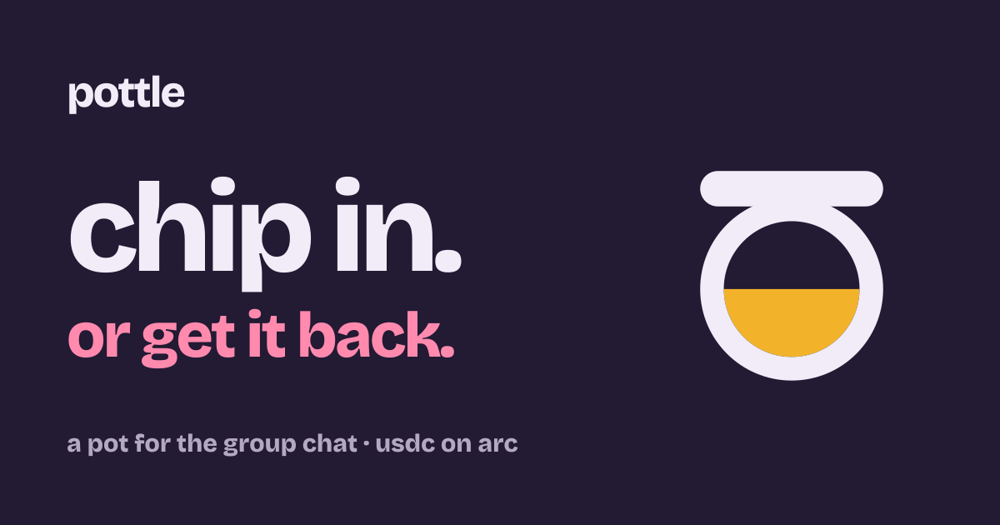

<p align="center">
  
</p>

# pottle

**a pot for the group chat.** set a goal and a deadline, share one link. hit the goal and the pot goes
to the organiser. miss it and everyone gets back exactly what they put in, automatically.

"let's all put in $20 for sarah's gift" usually means one person fronts the money and chases ten
people for weeks. pottle holds the money in a contract instead, so nobody fronts anything, nobody
chases anybody, and nobody (not the organiser, not us) can take it out early.

- live: **https://pottle-1.vercel.app**
- chain: arc testnet, chain id **5042002**. arc mainnet: see [deployments](#deployments)
- contract: [`0x6eB979445c951453C30edc1442fAbA5817bE5674`](https://explorer.testnet.arc.io/address/0x6eB979445c951453C30edc1442fAbA5817bE5674)
- **trying it as a reviewer: [`JUDGES.md`](JUDGES.md)**
- what it does not protect against: [`AUDIT.md`](AUDIT.md)
- reporting a vulnerability: [`SECURITY.md`](SECURITY.md)
- mit licensed

---

## what it does

| | |
| --- | --- |
| **all or nothing** | the pot releases to the organiser only once the goal is hit. past the deadline below the goal, everyone is refunded to the cent |
| **nobody can take it early** | one immutable contract holds every pot. no owner, no admin, no upgrade path, no fee |
| **one signature to chip in** | friends sign one message (eip-3009) and pottle pays the network fee. no approve step, no gas to buy |
| **sign in with an email** | friends get a wallet from their email through dynamic. no wallet app needed |
| **automatic payout and refund** | a pot that is due settles the moment anyone opens it, and a scheduled job settles the rest every ten minutes |
| **dollars or euros** | a pot is in usdc or eurc. euro pots are paid in and paid out in eurc |
| **add money by card** | circle's onramp kit, inside the app: card, apple pay or google pay, with circle's own id check |
| **made for group chats** | a live link preview ("7 in, $140 of $200"), a nudge button, a qr code, and a thank-you card once it pays out |

## how it uses arc

pottle leans on the parts of arc that make small group payments sensible:

- **fees in usdc.** a chip-in costs about a tenth of a cent in fees, paid in the same dollars being
  collected. nobody has to buy a gas token first, and pottle can sponsor the fee outright
- **sub-second finality.** a friend's coin drops into the pot on everyone's screen within seconds
- **circle's usdc and eurc as fiattoken.** both support eip-3009 `receiveWithAuthorization`, so a
  chip-in is one signature, and the contract (not the relayer) pulls the money
- **eurc on arc.** euro pots are native, not wrapped
- **circle onramp kit.** people with no usdc can buy it into their own wallet without leaving the pot

## how it works

```
organiser                 friends                         anyone / scheduled job
    |                         |                                     |
create(goal, deadline,        |                                     |
       wrap, currency,        |                                     |
       title, name) --------->|                                     |
    |       share the link    |                                     |
    |                         | sign receiveWithAuthorization       |
    |                         |   (nonce = pot id + name + salt)    |
    |                         |---> relayer ---> chipInWithAuthorization
    |                         |                                     |
    |       goal hit ----------------------------------------------> release(id)   -> organiser
    |       deadline passed, below goal ---------------------------> refundAll(id) -> each friend
```

- the signed nonce commits to the pot and the name, so whoever submits it cannot move the money to
  another pot or change the name shown for it
- `release` and `refundAll` are permissionless. the app and the scheduled job call them through a
  relayer so nobody pays gas, but anyone can
- a contributor whose refund transfer fails (for example a usdc-blocklisted address) is skipped and
  keeps a claimable balance, so one bad address cannot block everyone else's refund

## repo

```
contracts/   foundry. src/Pottle.sol, 25 tests including fuzzing, deploy script
web/         next.js app. landing at /, make a pot at /new, the pot at /p/[id]
  app/api/relay         sponsors chip-ins, payouts and refunds (simulated first, rate limited)
  app/api/cron/settle   pays out and refunds every due pot, called by the scheduled job
  app/api/drip          testnet only: $10 of test usdc for a new signed-in wallet
  app/api/onramp        circle onramp kit sessions, only for the signed-in user's own wallet
  scripts/e2e-testnet   end-to-end run on arc testnet with real usdc through the app's own api
brand/       mark, colours, social cards
.github/     the scheduled settle job
```

## run it

```bash
cd contracts && forge test
```

```bash
cd web && cp .env.example .env.local && npm install && npm run dev
```

every setting is explained in `web/.env.example`. with none set, the app still runs and says what
is missing instead of failing quietly.

## tests

- **25 contract tests** (`forge test`): payout, overfunding, refunds, blocked addresses, the 100
  person cap, euro pots, and signature binding (a signature for one pot, name, amount or currency
  cannot be replayed on another). money conservation is fuzzed over 1,000 runs
- **end-to-end on arc testnet** (`node web/scripts/e2e-testnet.mjs`): 15 checks with real usdc,
  through the running app. one-signature chip-in with a sponsored fee, a classic approve and chip-in,
  payout, refund after the deadline, the per-person pot lists, the scheduled job paying out a pot
  nobody touched, and a pot paying itself out when its page is opened

arc moves usdc through a native precompile that local forks cannot execute, so the unit tests use
a mock with the same eip-3009 rules and the real tokens are exercised on testnet.

## integrations

**dynamic.** email sign-in creates an embedded wallet, so a friend in a group chat needs nothing but
an email. the app's own endpoints (the testnet drip and the onramp sessions) verify the user's
dynamic session token against dynamic's published keys and only act for a wallet on that token.
code: [`web/components/DynamicHost.tsx`](web/components/DynamicHost.tsx), [`web/lib/auth.ts`](web/lib/auth.ts).

**circle.** usdc and eurc with eip-3009 for one-signature payments, and the onramp kit for buying
usdc by card inside the app (popup on iphones and in production, embedded elsewhere).
code: [`web/lib/wallet.ts`](web/lib/wallet.ts), [`web/components/AddMoney.tsx`](web/components/AddMoney.tsx).

## deployments

| network | chain id | Pottle |
| --- | --- | --- |
| arc testnet | 5042002 | [`0x6eB979445c951453C30edc1442fAbA5817bE5674`](https://explorer.testnet.arc.io/address/0x6eB979445c951453C30edc1442fAbA5817bE5674) |
| arc mainnet | 5042 | deploying before submission |

usdc on arc: `0x3600000000000000000000000000000000000000`.
eurc: `0xbEf5f6d51CB62b58e6A8f77868681825C6fe21c1` (mainnet), `0x89B50855Aa3bE2F677cD6303Cec089B5F319D72a` (testnet).
