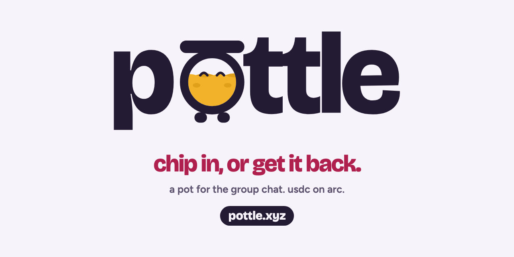
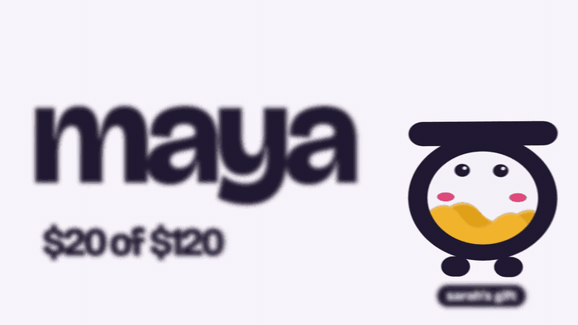
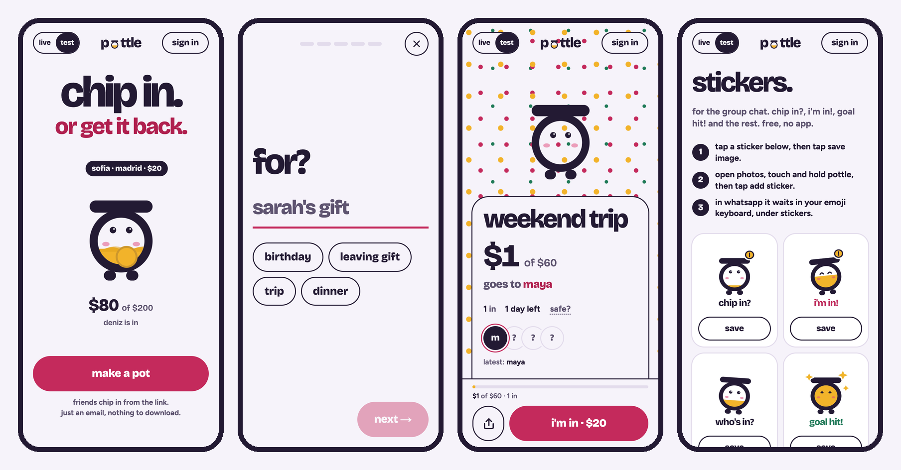

<p align="center">
  
</p>

<p align="center">
  <a href="https://github.com/Zoltan118/pottle/actions/workflows/ci.yml"></a>
  <a href="https://pottle.xyz"></a>
  <a href="https://test.pottle.xyz"></a>
  <a href="contracts"></a>
  <a href="LICENSE"></a>
</p>

<p align="center">
  <b><a href="https://pottle.xyz">pottle.xyz</a></b> ·
  <a href="https://test.pottle.xyz">try it free</a> ·
  <a href="JUDGES.md">for reviewers</a> ·
  <a href="https://pottle.xyz/stickers">stickers</a> ·
  <a href="AUDIT.md">what it does not protect against</a>
</p>

# pottle

**a pot for the group chat.** set a goal and a deadline, share one link. hit the goal and the pot goes
to the organiser. miss it and everyone gets back exactly what they put in, automatically.

"let's all put in $20 for sarah's gift" usually means one person fronts the money and chases ten
people for weeks. pottle holds the money in a contract instead, so nobody fronts anything, nobody
chases anybody, and nobody (not the organiser, not us) can take it out early.

- live on **arc mainnet**, real usdc: **https://pottle.xyz**
- try it free on **arc testnet**, free test dollars: **https://test.pottle.xyz** (new wallets get $10)
- both run the same code; the `live | test` switch in the nav moves between them
- contracts: see [deployments](#deployments)
- **trying it as a reviewer: [`JUDGES.md`](JUDGES.md)**
- what it does not protect against: [`AUDIT.md`](AUDIT.md)
- reporting a vulnerability: [`SECURITY.md`](SECURITY.md)
- mit licensed

<p align="center">
  
</p>

<p align="center">
  
</p>

---

## what it does

| | |
| --- | --- |
| **all or nothing** | the pot releases to the organiser only once the goal is hit. past the deadline below the goal, everyone is refunded to the cent. if a finished pot still cannot pay out 30 days after its deadline, everyone can take their money back |
| **nobody can take it early** | one immutable contract holds every pot. no owner, no admin, no upgrade path, no fee |
| **capped in beta** | there's been no third-party audit yet, so on mainnet a pot never holds more than $1,000 or €1,000. the contract enforces it, not just the app |
| **one signature to chip in** | friends sign one message (eip-3009) and pottle pays the network fee. no approve step, no gas to buy |
| **a first pot from an empty wallet** | making a pot is paid from the organiser's own wallet, so pottle sends a new, empty wallet one cent for that first fee (a pot costs about half a cent). once per wallet, checked on chain |
| **sign in with an email** | friends get a wallet from their email through dynamic. no wallet app needed |
| **automatic payout and refund** | a pot that is due settles the moment anyone opens it, and a scheduled job settles the rest every ten minutes |
| **dollars or euros** | a pot is in usdc or eurc. euro pots are paid in and paid out in eurc |
| **add money by card** | circle's onramp kit (part of circle app kits), inside the app: card, apple pay or google pay, with circle's own id check. live on the test site against circle's sandbox; switched on for mainnet once circle's production key is set up |
| **cash out** | the organiser sends the money to their exchange from the account sheet. kraken, binance and kucoin take usdc on arc directly, and pottle pays the fee. coinbase only takes usdc on base, so pottle moves it there through circle's cctp first, for about 6 cents. straight to a bank account is next |
| **receive** | a qr code and a tap-to-copy address for anyone sending usdc or eurc on arc |
| **face id sign-in, optional** | add a passkey and sign in with face id or a fingerprint instead of an email code. adding or removing a key on the account then asks for it too, enforced by dynamic's servers |
| **wraps that fit the pot** | a trip, a dinner or a birthday gets its own patterns first (boarding pass, sunset, palms; cheers, lemons, a set table; balloons, candles), read from the pot's title. the contract stores any wrap, so new ones never need a new contract |
| **made for group chats** | a live link preview ("7 in, $140 of $200"), a share button that sends the link with what's left to go, a qr code, and a thank-you card once it pays out |

## how it uses arc

pottle leans on the parts of arc that make small group payments sensible:

- **fees in usdc.** a chip-in costs about a tenth of a cent in fees, paid in the same dollars being
  collected. nobody has to buy a gas token first, and pottle can sponsor the fee outright
- **sub-second finality.** a friend's coin drops into the pot on everyone's screen within seconds
- **circle's usdc and eurc as fiattoken.** both support eip-3009 `receiveWithAuthorization`, so a
  chip-in is one signature, and the contract (not the relayer) pulls the money
- **eurc on arc.** euro pots are native, not wrapped
- **eip-3009 again for cash out.** an organiser signs one `transferWithAuthorization` and pottle's relayer
  sends it, so cashing out costs them nothing, in dollars or euros
- **circle cctp v2 with the forwarding service.** arc is cctp domain 26. a cash out to coinbase burns usdc
  on arc and circle mints it on base, taking its fee from the usdc, so neither the user nor pottle needs
  gas on base
- **circle onramp kit.** people with no usdc can buy it into their own wallet without leaving the pot.
  built the way arc's own guide describes it: the api key stays on the server, a session route mints a
  short-lived session only for the signed-in user's own wallet, and the browser just opens the widget

## built with

every package is on its latest release as of september 2026.

| | version | what pottle uses it for |
| --- | --- | --- |
| **arc** mainnet and testnet | chain 5042 / 5042002 | usdc as gas, sub-second finality, native usdc and eurc |
| **circle usdc and eurc** (fiattoken v2) | | one-signature chip-ins with eip-3009 `receiveWithAuthorization` |
| **circle onramp kit** (`@circle-fin/onramp-kit`, app kits) | 1.0.2 | buying usdc by card inside the app, with `createSessionRouteHandler` on the server |
| **circle cctp v2** and its forwarding service | | cash out to coinbase: burn on arc, circle mints on base |
| **dynamic** headless sdk (`@dynamic-labs-sdk/client`, `/evm`) | 1.33.3 | email and passkey sign-in drawn by pottle itself (no popup), embedded wallets, step-up with the passkey before account changes, session tokens verified server side |
| **viem** | 2.56.9 | reading pots, signing chip-ins, the relayer |
| **next.js** | 16.3.6 | the app, api routes, live link previews |
| **solidity** / **foundry** | 0.8.30 / 1.8.3 | the contract, unit, fuzz and invariant tests |

## how it works

```
organiser                 friends                         anyone / scheduled job
    |                         |                                     |
create(goal, deadline,        |                                     |
       wrap, currency,        |                                     |
       title, name) --------->|                                     |
    |       share the link    |                                     |
    |                         | sign receiveWithAuthorization       |
    |                         |   (nonce = pot id + name + salt)    |
    |                         |---> relayer ---> chipInWithAuthorization
    |                         |                                     |
    |       goal hit ----------------------------------------------> release(id)   -> organiser
    |       deadline passed, below goal ---------------------------> refundAll(id) -> each friend
```

- the signed nonce commits to the pot and the name, so whoever submits it cannot move the money to
  another pot or change the name shown for it
- `release` and `refundAll` are permissionless. the app and the scheduled job call them through a
  relayer so nobody pays gas, but anyone can
- a contributor whose refund transfer fails (for example a usdc-blocklisted address) is skipped and
  keeps a claimable balance, so one bad address cannot block everyone else's refund

## repo

```
contracts/   foundry. src/Pottle.sol, 44 tests, 6 invariants, deploy script
web/         next.js app. landing at /, make a pot at /new, the pot at /p/[id], how it works at /about
  app/api/relay         sponsors chip-ins, cash outs, payouts and refunds (simulated first, rate limited)
  app/api/cron/settle   pays out and refunds every due pot, called by the scheduled job
  app/api/drip          testnet only: $10 of test usdc for a new signed-in wallet
  app/api/onramp        circle onramp kit sessions, only for the signed-in user's own wallet
  scripts/e2e-testnet   end-to-end run on arc testnet with real usdc through the app's own api
brand/       mark, colours, social cards
.github/     ci (tests, lint, types, build on every push), the scheduled settle job, issue templates
```

## run it

```bash
cd contracts && forge test
```

```bash
cd web && cp .env.example .env.local && npm install && npm run dev
```

every setting is explained in `web/.env.example`. with none set, the app still runs and says what
is missing instead of failing quietly.

## tests

- **44 contract tests** (`forge test`): payout, overfunding, refunds, the $1,000 beta cap, blocked addresses, the 30 day
  payout grace, the 100 person cap, euro pots, a hostile re-entering token, and signature binding (a
  signature for one pot, name, amount or currency cannot be replayed on another). money conservation
  is fuzzed over 1,000 runs
- **invariant testing**: 15,360 random calls across four people and both currencies; after every
  step the contract holds exactly what it owes and no pot is above the cap. **100% line, statement, branch and function coverage**
- **slither** static analysis: no exploitable findings. details in [`AUDIT.md`](AUDIT.md)
- **on arc mainnet with real money** (2026-10-04): a new account made a pot from an empty wallet,
  a sponsored $1 chip-in hit the goal, the scheduled job paid it out, and a sponsored $1 cash out
  arrived exactly. each step checked on chain
- **the first-pot fee** (`node web/scripts/topup-test.mjs`, arc testnet): an empty new wallet gets
  a cent that pays for its pot; asking again, a used wallet, two requests at once and the daily cap
  are refused
- **end-to-end on arc testnet** (`node web/scripts/e2e-testnet.mjs`): 34 checks with real usdc,
  through the running app. one-signature chip-in with a sponsored fee, a classic approve and chip-in,
  payout, refund after the deadline, the per-person pot lists, the scheduled job paying out a pot
  nobody touched, a pot paying itself out when its page is opened, a pot with a themed wrap and its
  link preview, and cash out: every address the
  relayer must refuse, no sponsoring or fee top-up without a signed-in account, exact amounts in usdc and eurc, no
  replay, and a real cash out through base (burned on arc testnet, minted on base sepolia)

arc moves usdc through a native precompile that local forks cannot execute, so the unit tests use
a mock with the same eip-3009 rules and the real tokens are exercised on testnet.

## integrations

**dynamic.** email sign-in creates an embedded wallet, so a friend in a group chat needs nothing but
an email. pottle draws the sign-in itself on dynamic's headless sdk. an optional passkey signs the
person in with face id, and dynamic asks for it before a key is added to or removed from the account. the app's own endpoints (the relayer's cash outs, the testnet drip and the onramp
sessions) verify the user's dynamic session token against dynamic's published keys and only act for a
wallet on that token.
code: [`web/lib/dynamicClient.ts`](web/lib/dynamicClient.ts), [`web/components/SignIn.tsx`](web/components/SignIn.tsx), [`web/components/Lock.tsx`](web/components/Lock.tsx), [`web/lib/auth.ts`](web/lib/auth.ts).

**circle.** usdc and eurc with eip-3009 for one-signature payments, and the onramp kit for buying
usdc by card inside the app (popup on iphones and in production, embedded elsewhere), and cctp v2
with the forwarding service for cashing out to coinbase on base.
code: [`web/lib/wallet.ts`](web/lib/wallet.ts), [`web/components/AddMoney.tsx`](web/components/AddMoney.tsx), [`web/components/CashOut.tsx`](web/components/CashOut.tsx).

## deployments

| network | chain id | Pottle |
| --- | --- | --- |
| arc testnet | 5042002 | [`0x28c404bCD028aC3A20e26Dd700F9E2eE72A8E91F`](https://explorer.testnet.arc.io/address/0x28c404bCD028aC3A20e26Dd700F9E2eE72A8E91F) (verified; the same code as mainnet: every fix from the review, and any wrap value accepted so new looks never need a new contract) |
| arc mainnet | 5042 | [`0xB53D47878283C2f2D44739B39c1B576469A50D5c`](https://explorer.arc.io/address/0xB53D47878283C2f2D44739B39c1B576469A50D5c) (verified, [exact match on sourcify](https://sourcify.dev/server/v2/contract/5042/0xB53D47878283C2f2D44739B39c1B576469A50D5c); the same code as testnet, with the 30 day payout grace and the $1,000 beta cap) |

usdc on arc: `0x3600000000000000000000000000000000000000`.
eurc: `0xbEf5f6d51CB62b58e6A8f77868681825C6fe21c1` (mainnet), `0x89B50855Aa3bE2F677cD6303Cec089B5F319D72a` (testnet).
